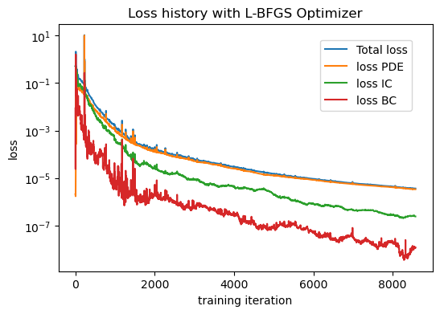
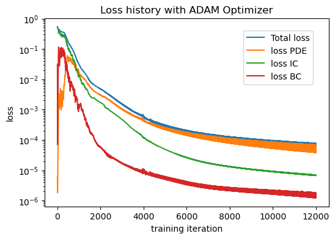
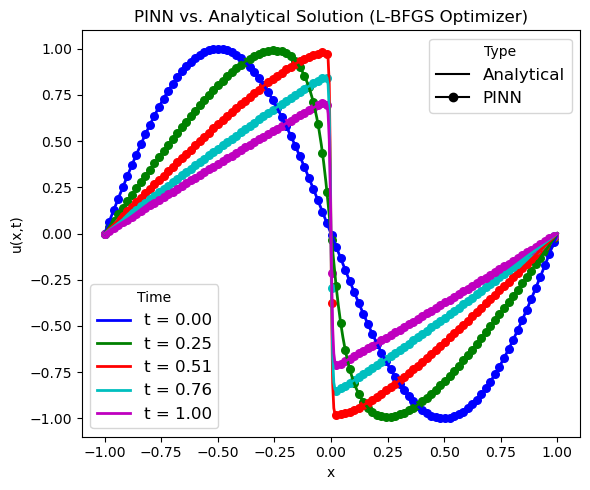
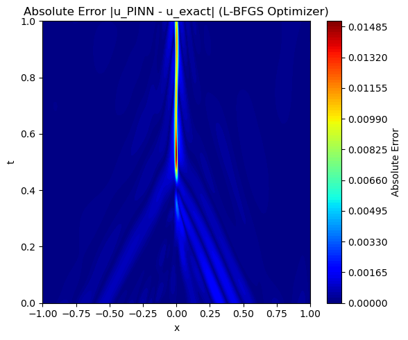
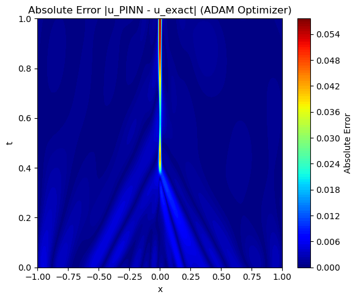
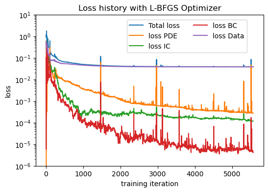
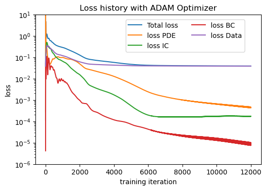
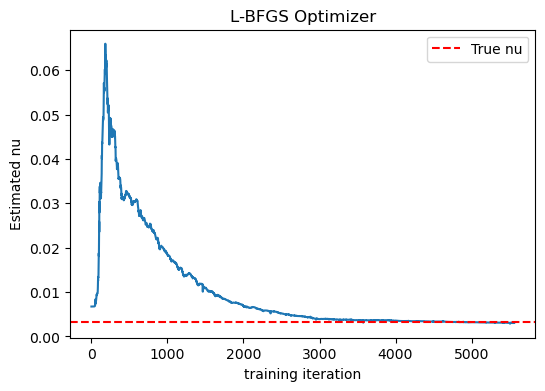
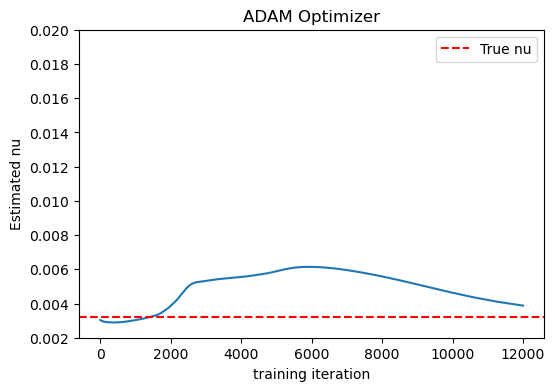

# PINN for Forward and Inverse Burgers' Equation (PyTorch)

This repository demonstrates the implementation of **Physics-Informed Neural Networks (PINNs)** in **PyTorch** for solving both the **forward** and **inverse** one-dimensional viscous Burgers' equation.

The project illustrates how neural networks can incorporate physical laws directly into the loss function to solve partial differential equations (PDEs), while also estimating unknown physical parameters.

---

## Governing Equation

The one-dimensional viscous Burgers' equation is

$$\frac{\partial u}{\partial t}+u\frac{\partial u}{\partial x}=
\nu
\frac{\partial^2u}{\partial x^2},
$$

where

- $u(x,t)$ is the velocity,
- $\nu$ is the kinematic viscosity (or diffusion coefficient)

Here, the computational domain is

$$
x\in[-1,1],
\qquad
t\in[0,1].
$$

## Initial condition

$$
u(x,0)=-\sin(\pi x).
$$

## Boundary conditions

$$
u(-1,t)=u(1,t)=0.
$$

---

# Forward Problem

The forward PINN assumes the viscosity is known and predicts the solution $u(x,t)$ throughout the computational domain by minimizing PDE residual, Initial condition loss, and Boundary condition loss.

---

# Inverse Problem

In the inverse probelm, thekinematic visocity is unkonwn and the main goal is to estimate it. **The inverse PINN simultaneously learns
the solution $u(x,t)$ and the unknown viscosity $\nu$.**

The viscosity is treated as a trainable neural network parameter and is optimized together with the network weights.

---

# Analytical Solution

https://en.wikipedia.org/wiki/Burgers%27_equation

Synthetic training data are generated using the analytical solution obtained from the **Hopf–Cole transformation**, which converts Burgers' equation into the linear heat equation.

The resulting integral solution is evaluated using **Gauss–Hermite quadrature**, providing an accurate reference solution for validation.

---

# PINN Loss Function

A neural network is trained to approximate the unknown solution field.

The loss function combines:

* Data residual loss
* PDE residual loss
* Boundary condition loss
* Initial condition loss

$$\mathcal{L} = \mathcal{L}_{Phys} + \lambda_{data} \mathcal{L}_{data}$$

where

$$\mathcal{L}_{Phys} = \mathcal{L}_{PDE} + \mathcal{L}_{BC} + \mathcal{L}_{IC}$$

Automatic differentiation is used to evaluate the derivatives appearing in the governing equations.

---

# Requirements

- Python 3.10+
- PyTorch
- NumPy
- SciPy
- Matplotlib
- Jupyter Notebook

---

# Running the notebooks

Open either notebook using Jupyter Lab or Jupyter Notebook.

Forward problem

```
notebooks/Burgers_Forward_PINN_PyTorch.ipynb
```

Inverse problem

```
notebooks/Burgers_Inverse_PINN_PyTorch.ipynb
```

---

# Representative Results

## Forward Problem Using Either L-BFGS or ADAM Optimizers
### Convergence History

<table>
  <tr>
    <td>
    <td>
  </tr>
</table>

### Solution of $u(x,t)$

<table>
  <tr>
    <td>
    <td>
  </tr>
</table>

### Absolute error of PINN prediction vs. analytical solution

<table>
  <tr>
    <td>
    <td>
  </tr>
</table>


## Inverse Problem Using Either L-BFGS or ADAM Optimizers
### Convergence History

<table>
  <tr>
    <td>
    <td>
  </tr>
</table>

### Estimation of $nu$

<table>
  <tr>
    <td>
    <td>
  </tr>
</table>

---

# Citation

M. Raissi, P. Perdikaris, G. E. Karniadakis, **Physics-informed neural networks: A deep learning framework for solving forward and inverse problems involving nonlinear partial differential equations**,  Journal of Computational Physics 378 (2019) 686–707

https://www.sciencedirect.com/science/article/pii/S0021999118307125?via%3Dihub
